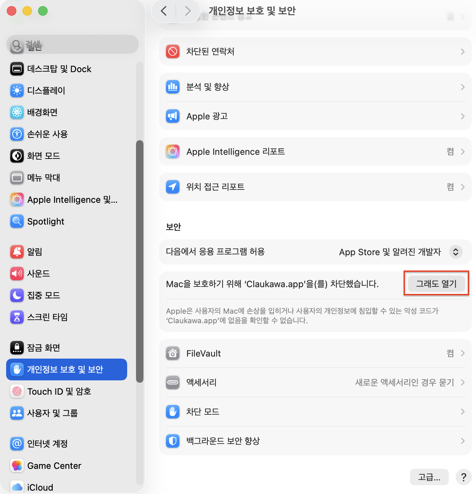

# Claukawa

[English](README.md) · **한국어**

Claude Code 세션의 작업 상태를 시각화해주는 항상 위 창 데스크톱 인디케이터. 로컬 HTTP 게이트웨이로 Claude Code의 hook 이벤트를 받아 세션마다 별도 캐릭터 창을 띄웁니다 (최대 5개).

## 빠른 시작

### Windows

1. 최신 GitHub Release에서 `Claukawa-{version}-win.exe` 다운로드.
2. 더블클릭으로 실행. 첫 실행 시 `~/.claude/settings.json`에 Claude Code hook을 등록할지 묻는 다이얼로그가 뜨면 승인 (기존 hook은 그대로 보존, 원본 파일은 자동 백업).
3. 터미널에서 Claude Code 세션을 열면 → 해당 세션용 캐릭터 창이 화면에 나타나고 Claude의 작업에 따라 갱신됩니다.

### macOS

1. 최신 Release에서 `Claukawa-{version}-mac.zip` 다운로드 후 압축 해제.
2. `Claukawa.app`을 `/Applications`로 드래그.
3. 더블클릭하면 **"Mac을 보호하기 위해 'Claukawa.app'을(를) 차단했습니다"** 라는 알림이 뜹니다 (정상 — ad-hoc 서명만 되어있고 Apple 공증은 안 받았기 때문).
4. **시스템 설정 → 개인정보 보호 및 보안** 열기 → 화면 하단 *보안* 섹션에서 `Mac을 보호하기 위해 'Claukawa.app'을(를) 차단했습니다` 메시지 옆 **그래도 열기** 클릭 → 비밀번호 입력 → 확인.

   

5. 한 번 허용하면 그 다음부터는 더블클릭으로 정상 실행.
6. 첫 실행 화면에서 언어 선택 → hook 등록 다이얼로그 승인 → Claude Code 세션 시작.

> **참고**: macOS Sequoia(15)부터는 "우클릭 → 열기" 방식이 막혔고 위처럼 시스템 설정에서 명시적으로 허용해야 합니다.

## 상태 카테고리

각 Claude Code hook 이벤트는 11개 카테고리 중 하나로 매핑됩니다:

| 카테고리 | 트리거 |
| --- | --- |
| `session_start` | 새 Claude Code 세션 시작 |
| `thinking` | 사용자 프롬프트 제출, Claude 추론 중 |
| `editing` | `Edit` / `Write` / `MultiEdit` / `NotebookEdit` |
| `reading` | `Read` / `Grep` / `Glob` |
| `bashing` | `Bash` / `PowerShell` |
| `web` | `WebFetch` / `WebSearch` |
| `subagent` | `Task` (서브에이전트 호출, 호출 동안 sticky 유지) |
| `mcp` | `mcp__*` 도구 |
| `waiting_input` | 권한 팝업 / 알림 (1.5초 watchdog로 자동 감지) |
| `idle` | 응답 완료 또는 세션 종료 |
| `compacting` | 컨텍스트 압축 진행 중 |

기본 캐릭터 팩은 chroma-key 추출된 PNG 11장입니다.

## 캐릭터 이미지 바꾸기

기본 팩이 마음에 안 들거나 자기 캐릭터 쓰고 싶으면 카테고리별로 교체 가능합니다.

1. 트레이 아이콘(Windows 작업표시줄 우하단 `∧`) 또는 메뉴바(macOS) 클릭 → **설정 열기**
2. **GIF** 탭 선택. 11개 카테고리가 미리보기와 함께 나열됩니다.
3. 바꾸고 싶은 카테고리 옆 **변경…** 클릭 → 파일 선택기에서 이미지 선택
4. 즉시 반영. 다음 hook 이벤트부터 새 이미지로 표시됩니다.

지원 포맷: PNG (투명도 권장), GIF (애니메이션 가능), JPG, WEBP, BMP. 캐릭터 뒤 배경이 뚜렷한 사각형이면 미리 chroma-key/투명 처리한 PNG가 가장 자연스럽습니다.

기본값으로 되돌리려면 같은 행의 **기본값** 버튼.

## 설정

트레이 아이콘(Windows) 또는 메뉴바(macOS)에서 열기:

- **슬롯 정책** — 5개 창이 떠있는 상태에서 6번째 세션이 도착할 때:
  - `idle_only` (기본): idle 상태 창만 밀어내고 활동 중인 창은 보호
  - `lru`: 가장 오래된 창부터 무차별 교체
  - `reject`: 새 세션 거부
- **말풍선 트리거** — `hover_only` (기본) / `event_burst` (이벤트 시 3초 깜빡) / `always` / `off`
- **자동 시작** — 로그인 시 Claukawa 자동 실행 (Windows 레지스트리 / macOS LaunchAgent)
- **Hook 탭** — 등록 상태 확인 및 등록/해제

## 아키텍처

```
[Claude Session A] ──┐
[Claude Session B] ──┼─→ POST 127.0.0.1:17135/event ─→ Dispatcher ─→ 세션별 캐릭터 창
[Claude Session C] ──┘
```

단일 프로세스 Python 앱. PySide6 GUI는 메인 스레드, stdlib `http.server`는 워커 스레드에서 동작하고 Qt signal/slot으로 thread 간 안전 연결. 외부 의존성은 `PySide6`, `Pillow`, `platformdirs`만.

이벤트 흐름:
- `PreToolUse` → 도구 카테고리에 맞는 캐릭터로 전환, 말풍선엔 도구의 description(또는 대상 파일명)
- 권한 모드 도구가 1.5초 안에 PostToolUse 안 오면 → "?" 캐릭터로 자동 전환 (권한 팝업 추정), 승인 시 원래 캐릭터로 복귀
- 서브에이전트 (`Agent`/`Task`) 내부 도구 호출은 `agent_id`로 식별해 sticky하게 부모 캐릭터 유지

## 소스에서 빌드

```bash
pip install -e ".[build,dev]"
python tools/generate_placeholder_gifs.py     # 텍스트 placeholder GIF 재생성
pytest                                         # 테스트 실행
pyinstaller build/claukawa-win.spec            # Windows
pyinstaller build/claukawa-mac.spec            # macOS
```

## 라이선스

MIT
